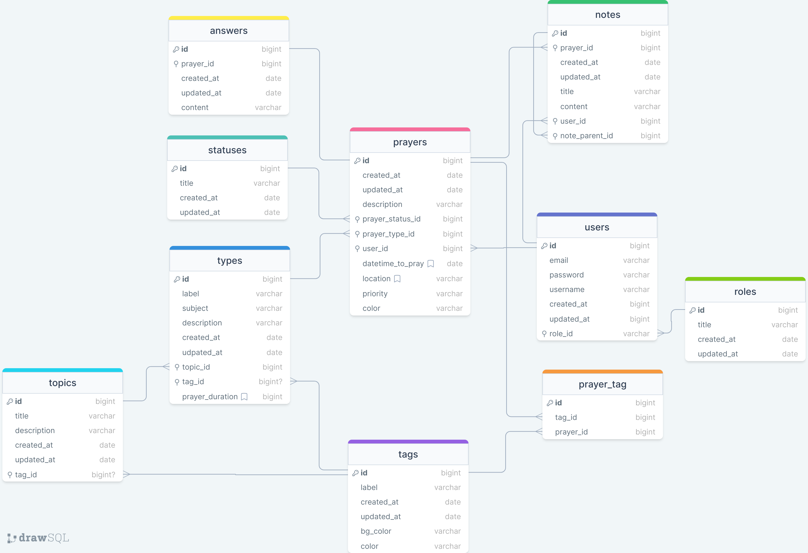

# Prayer Dom

Prayer Dom helps you manage and get a better view on your prayers


## Authors

- [@andrianarivo](https://www.github.com/andrianarivo)


## Documentation

<div align="center">
  <p><em>Entity Relationship Diagram</em></p>
  
</div>

## Features

- Manage prayers
- Create Prayer types
- Change your prayer status
- Create Topics


## Installation

Install ruby, node.js and yarn (always use LTS version)

```bash
  ruby --version
  node --version
  yarn --version
```
    
## Run Locally

Clone the project

```bash
  git clone https://github.com/andrianarivo/prayer_dom
```

Go to the project directory

```bash
  cd my-project
```

Install dependencies

```bash
  bundle && rails db:setup
```

Start the server

```bash
  rails s
```


## Running Tests

To run tests, run the following command

```bash
  bundle exec rspec
```


## License

[MIT](./LICENSE)
